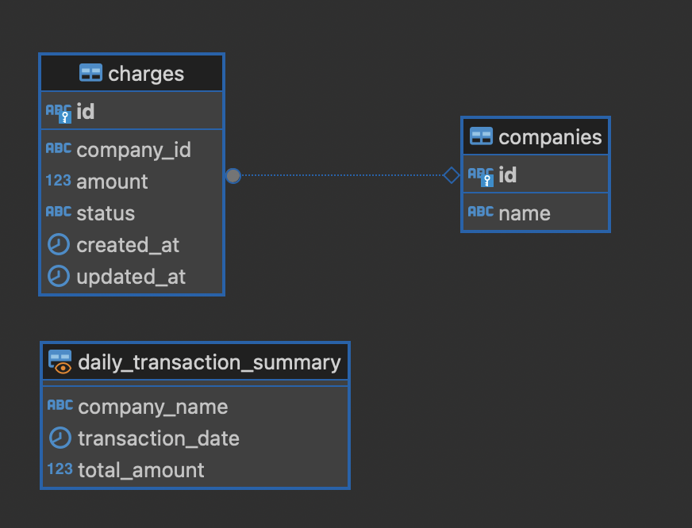

# Technical Test Etl Next Technologies

## Descripción
Este proyecto se lleva a cabo para generar un etl, el cual esta esta estructurado con arquitecura modular basado en capas, decidi usar el lenguaje de programación python ya que es un lenguaje bastante amigable para el analisis de datos.
El proyecto usa Docker y Docker Compose para configurar y gestionar el entorno de ejecución.

## Porque PostgresSQL?
Elegi utilizar PostgreSQL porque se requiere relaciones bien definidas, integridad de datos y consultas eficientes, PostgreSQL se integra fácilmente con herramientas ETL y BI, facilitando análisis y reportes.
Para un sistema relacional y analítico, es la mejor elección sobre NoSQL.

## Retos de la prueba
- Manejo de datos inconsistentes: Se encontraron valores nulos y formatos incorrectos en columnas críticas, lo que requirió validaciones adicionales.
- Carga por lotes: Para mejorar el rendimiento, se implementó un procesamiento por lotes en la inserción de datos.
- Uso de Lazy Loading: Se emplearon generadores en la lectura del CSV para evitar sobrecargar la memoria con grandes volúmenes de datos.
- Optimización de inserciones: Se usó execute_values para insertar datos en bloques, reduciendo el impacto en la base de datos.
- Consistencia referencial: Se aseguraron relaciones correctas entre tablas para evitar registros huérfanos o duplicados.


## Transformaciones en la data

- Validación de filas: Se descartaron filas con datos esenciales faltantes (IDs, montos, fechas, etc.).
- Normalización de IDs: Se reemplazaron IDs de empresa inválidos (*******) por un valor por defecto.
- Corrección de nombres: Se sustituyeron nombres inválidos como MiP0xFFFF por MiPasajefy.
- Conversión de montos: Se convirtieron valores de montos a float, asegurando un máximo de 14 dígitos y redondeo a 2 decimales.
- Formateo de fechas: Se transformaron cadenas de fechas (YYYY-MM-DD) a objetos date.

## Diagrama de BD



## 🚀 Instalación y Ejecución

### 1️⃣ Requisitos
- Docker y Docker Compose instalados.

### 2️⃣ Construcción y Ejecución
```bash
# Clonar el repositorio
git clone https://github.com/serchbauti/technical_etl_next
cd technical-test

# Construir e iniciar los servicios
docker-compose up -d
```

### 3️⃣ Ejecución del Script ETL

Una vez que los servicios estén en funcionamiento, puedes ejecutar el script `etl.py` para iniciar el proceso ETL. Asegúrate de que el contenedor de la aplicación esté corriendo.

```bash
# Acceder al contenedor de la aplicación
docker exec -it <nombre_del_contenedor_app> bash

# Ejecutar el script ETL
python src/etl.py
```

Reemplaza `<nombre_del_contenedor_app>` con el nombre real del contenedor de la aplicación, que puedes obtener ejecutando `docker ps`.

## 🗄️ Visualización de la Base de Datos

Una vez que los servicios estén en funcionamiento, puedes visualizar la base de datos utilizando una herramienta de administración de bases de datos como pgAdmin, DBeaver o cualquier cliente SQL de tu preferencia.

### Conexión a la Base de Datos

Utiliza los siguientes parámetros de conexión:

- **Host:** `localhost`
- **Puerto:** `5432`
- **Base de Datos:** `test_db`
- **Usuario:** `admin`
- **Contraseña:** `adminpass`

## 📄 Notas Adicionales

- Asegúrate de que los puertos necesarios no estén siendo utilizados por otros servicios.
- Puedes detener los servicios en cualquier momento con `docker-compose down`.


